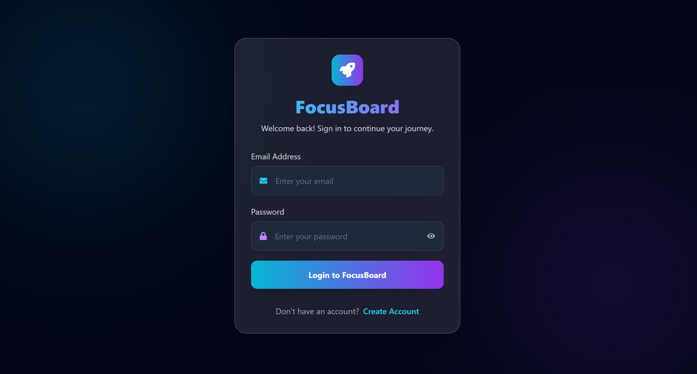
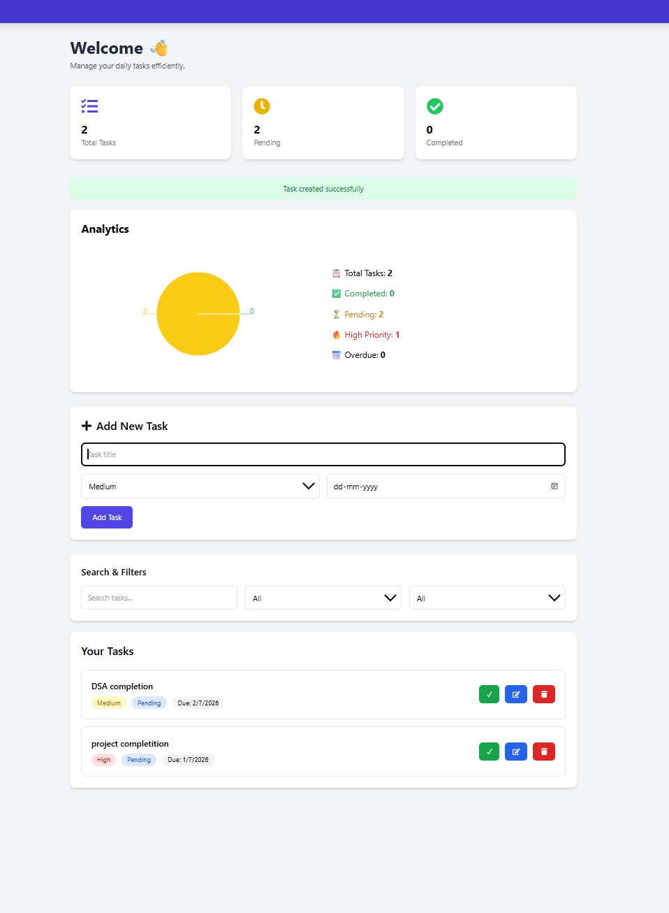
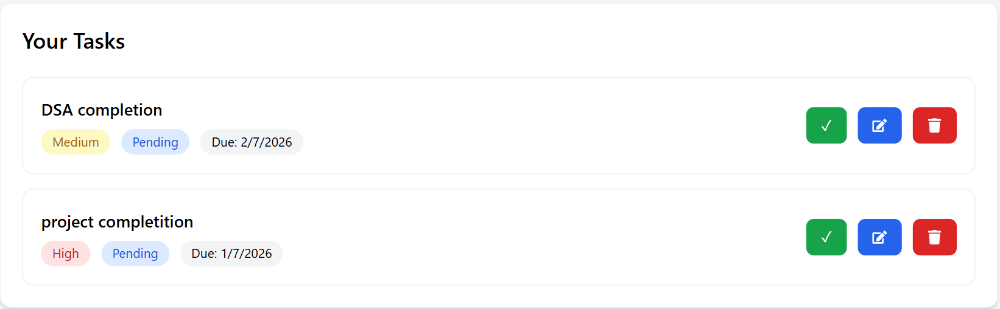

 📋 TaskFlow - Smart Task Management System

A modern Full Stack Task Management application built using the **MERN Stack**. TaskFlow helps users organize daily tasks efficiently with secure authentication, task prioritization, due dates, search, filters, and task status management.

---

🚀 Features

🔐 Authentication
- User Registration
- User Login
- JWT Authentication
- Protected Routes
- Secure Logout

 ✅ Task Management
- Create Tasks
- Edit Tasks
- Delete Tasks
- Mark Tasks as Completed/Pending
- User-specific Tasks
- Task Priority (High / Medium / Low)
- Due Date Support

 📊 Dashboard
- Total Tasks
- Pending Tasks
- Completed Tasks
- Search Tasks
- Filter by Status
- Filter by Priority

---
📸 Screenshots

## Login Page



---

## Dashboard



---

## Task Management



---


---
 🛠 Tech Stack

## Frontend
- React.js
- React Router DOM
- Axios
- Tailwind CSS
- React Icons

## Backend
- Node.js
- Express.js
- JWT Authentication
- bcryptjs

## Database
- MongoDB Atlas
- Mongoose

## Development Tools
- Visual Studio Code
- Postman
- MongoDB Compass
- Git & GitHub

---

📁 Project Structure

```
TaskFlow
│
├── frontend
│   ├── src
│   ├── public
│   ├── package.json
│   └── vite.config.js
│
├── backend
│   ├── config
│   ├── controllers
│   ├── middleware
│   ├── models
│   ├── routes
│   ├── server.js
│   └── package.json
│
├── README.md
└── .gitignore
```

---
⚙️ Installation & Setup

## 1️⃣ Clone Repository

```bash
git clone https://github.com/rajdubey7623/TaskBoard
cd taskflow
```

---

## 2️⃣ Backend Setup

```bash
cd backend

npm install
```

Create a `.env` file inside the backend folder.

```env
PORT=5000

MONGO_URI=your_mongodb_connection_string

JWT_SECRET=your_secret_key

GEMINI_API_KEY=your_api_key
```

Run the backend server

```bash
npm run dev
```

Backend runs on:

```
http://localhost:5000
```

---

## 3️⃣ Frontend Setup

Open another terminal

```bash
cd frontend

npm install

npm run dev
```

Frontend runs on

```
http://localhost:5173
```

---

🌍 Environment Variables

Create a `.env` file inside **backend**

```env
PORT=5000

MONGO_URI=your_mongodb_connection_string

JWT_SECRET=your_secret_key

GEMINI_API_KEY=your_api_key
```

---

📄 .env.example

```env
PORT=

MONGO_URI=

JWT_SECRET=

GEMINI_API_KEY=
```

---


 📌 API Endpoints

## Authentication

| Method | Endpoint | Description |
|--------|----------|-------------|
| POST | `/api/auth/register` | Register User |
| POST | `/api/auth/login` | Login User |

---

## Tasks

| Method | Endpoint | Description |
|--------|----------|-------------|
| GET | `/api/tasks` | Get All Tasks |
| POST | `/api/tasks` | Create Task |
| PUT | `/api/tasks/:id` | Update Task |
| DELETE | `/api/tasks/:id` | Delete Task |

---

 🎯 Future Enhancements

- Analytics Dashboard
- Drag & Drop Task Management
- AI Task Suggestions
- Natural Language Task Creation
- Collaboration Features
- Activity Logs
- Server-side Pagination

---

 👨‍💻 Author
       
  Raj Kumar Dubey


Full Stack MERN Developer

---

📜 License

This project is created for educational and assignment purposes.
## 🌐 Live Demo

- 🔵 Frontend: https://task-board-kdrqpil8f-raj23jids030-3334s-projects.vercel.app  
- 🟢 Backend: https://taskboard-backend-ayhc.onrender.com